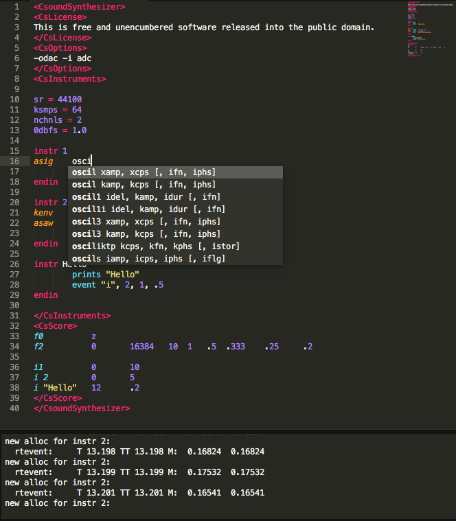
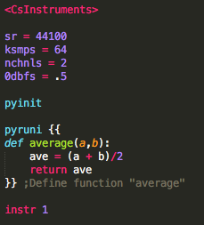

# CsoundST

Csound syntax for Sublime Text 4

## About

A small convenience package for writing Csound in Sublime Text 3 more quickly and easily. Includes a syntax definition, a build system, and a list of completions.

Based on Takahiko Tsuchiya's work. This version uses YAML and the newer .sublime-syntax file format for its Csound syntax definition, rather than a .tmLanguage XML file.

It is intended to support common alternate styles for some statements, for example `-iadc` vs. `-i adc`, `i1` vs. `i 1`, etc. will be captured by the same syntax scope.

As seen above, the list of completions includes stubs for arguments to opcodes.

It will also highlight python blocks as appropriate in .csd files, used with pyrun, pyruni, etc. You may have to redirect the python context's push value to the location of your python .sublime-syntax file.

I plan to add more to this collection. Contributions, style enhancements, fixes, additions, regex wizardry, etc. are welcome.

## Installation

New (in v1.0.0): The recommended installation method is using Package Control. The package is named CsoundSyntax.

## Thanks

Thanks to Takahiko Tsuchiya and Rory Walsh.